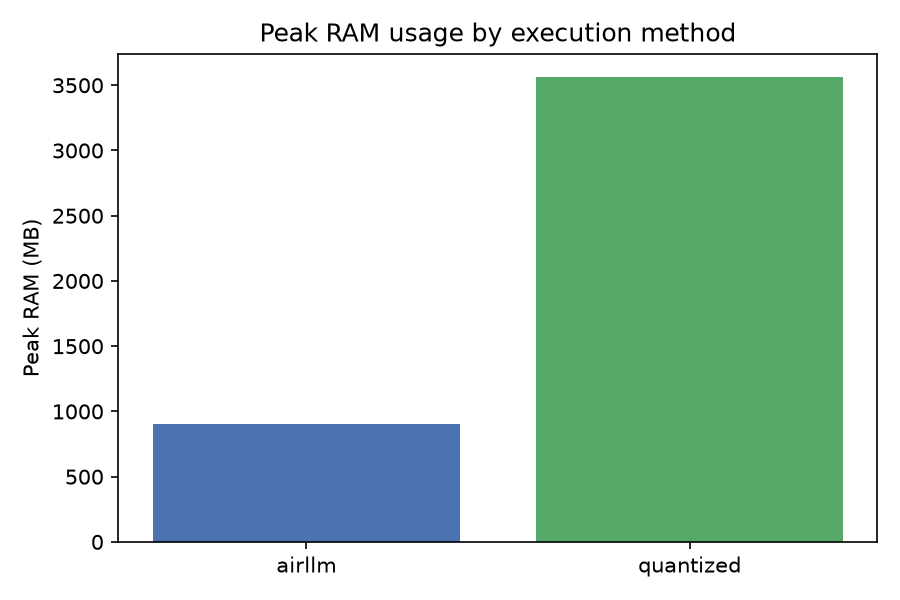
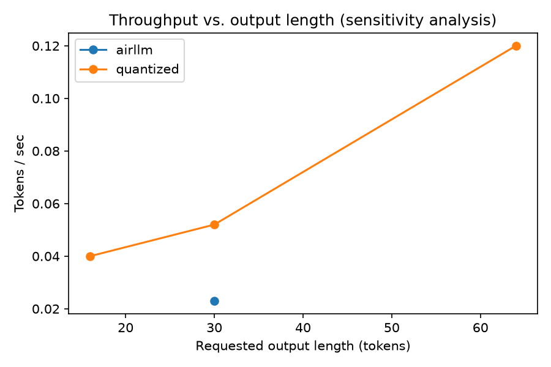
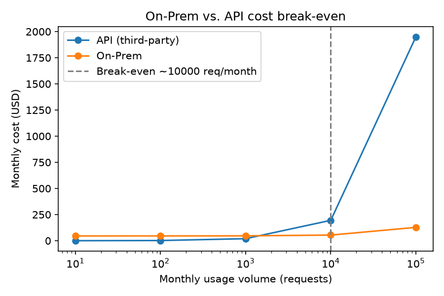
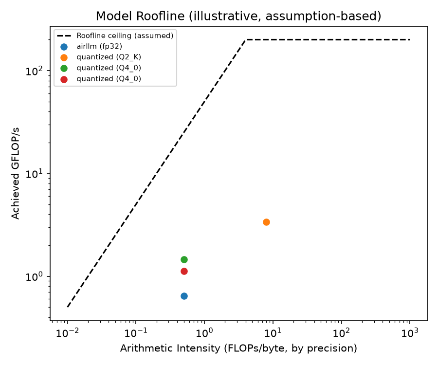

# Local LLM Bench — Baseline vs. AirLLM vs. Quantization

**קורס:** סוכני AI, תשפ"ו סמסטר ב · **מטלה:** 5 (`ex05-AirLLM`) · **קוד קבוצה:** `uoh-rl07`

כלי benchmark המריץ מודל שפה גדול בשלוש דרכים על מחשב **ללא GPU ייעודי** — טעינה
סטנדרטית מלאה (Baseline), טעינה שכבה-אחר-שכבה (AirLLM), והרצה בקוונטיזציה (Ollama)
— ומפיק מדדים, ניתוח כלכלי (On-Prem מול API), והשוואות מבוססות-נתונים. נבנה כתוכנה
מקצועית לפי `software_submission_guidelines-V3.pdf`: SDK יחיד, `ApiGatekeeper`
מרכזי, בדיקות עם כיסוי 85%+, ללא ערכים מוקשחים, ניהול גרסאות.

> **לפי דרישת מסמך המטלה (`ex05-AirLLM.pdf.pdf` §8), קובץ זה משמש כדוח הטכני
> המעמיק הסופי** (לא רק מדריך התקנה) — כולל מפרט חומרה, תיאור ותוצאות כל ניסוי,
> ניתוח כלכלי, Model Roofline, ומענה מפורש לכל שאלות המחקר, עם כל הגרפים/הטבלאות
> משובצים ישירות בתוכן שלמטה. הוראות ההתקנה/הפעלה נמצאות בסוף המסמך.

## מפרט חומרה שנבדק

> **⚠ תיקון:** המדידה הראשונית (בתחילת הפרויקט) דיווחה RAM ~76GB — **זו הייתה
> טעות תמלול פי 10** מפלט `wmic` מקוטע. המספר הנכון, מאומת דרך
> `Get-CimInstance Win32_OperatingSystem` וגם באופן עקיף דרך כישלון טעינה בפועל
> של מודל 72B, הוא **~7.65GB**. זה משנה משמעותית את סיפור הניסוי (לטובה — ניגוד
> חד יותר בין Baseline לבין AirLLM) — ר' פירוט ב"יומן ניסויים" למטה.

| רכיב | ערך |
|---|---|
| CPU | Intel Core i7-1165G7, 4 cores / 8 threads |
| **RAM** | **~7.65 GB** (8,211,927,040 בייטים) |
| GPU | Intel Iris Xe משולב — **ללא CUDA**, אין GPU ייעודי |
| אחסון | SSD |
| דיסק פנוי | ~115 GB (מתוך ~475GB; ירד לאחר הורדת מודלים) |

**נימוק בחירת המודל** (`microsoft/Phi-3-medium-4k-instruct`, ~14B, MIT, לא-gated):
ר' `docs/PRD.md` §1.2 ו-`docs/PLAN.md` ADR-1 — עם ~7.65GB RAM בלבד, המודל (~14GB
ב-FP16, ~28GB ב-FP32) פשוט לא נכנס לזיכרון. **זה בדיוק מה שקרה בפועל, לא רק
תחזית**: Baseline נכשל בפועל בשתי דרכים עצמאיות (ניסוי 2, ניסוי 3 למטה), בעוד
AirLLM (שכבה אחת בזיכרון בכל רגע) הצליח בפועל (ניסוי 4).

## שאלות המחקר (נענות במלואן להלן)

(המקור: `ex05-AirLLM.pdf.pdf` §4; הרשימה המלאה עם הקשר מלא ב-`docs/PRD.md` §1.1;
תשובה מרוכזת לכל שאלה בטבלה תחת "מענה מרוכז לשאלות המחקר" למטה)

1. מהו צוואר הבקבוק האמיתי שמונע הרצה ישירה — זיכרון או כוח חישוב?
2. כיצד AirLLM משנה את הקצאת המשאבים, והקשר לזיכרון וירטואלי/Paging?
3. מה השפעת הקוונטיזציה על זיכרון, מהירות, ואיכות פלט?
4. כיצד Prefill/Decode משתקפים במדדי TTFT מול TPOT?
5. מהו המחיר (Latency/Throughput) עבור היכולת להריץ מודל גדול על חומרה צנועה?
6. מתי כדאי כלכלית לעבוד מקומית, ומתי עדיף API חיצוני?

## מבנה הדוח (ניווט מהיר)

יומן הניסויים למטה (ניסויים 1–7) מכיל את כל הראיות הגולמיות, התקלות שנמצאו
ותוקנו, והניתוח לכל שיטה. לאחריו: "מענה מרוכז לשאלות המחקר" (התשובה הישירה לכל
אחת מ-6 השאלות, עם הפניה לניסוי הרלוונטי), "הרחבה מקורית" (Model Roofline), ולבסוף
הוראות התקנה/הפעלה/שחזור.

## יומן ניסויים וממצאים

> הערה על "צילומי מסך": אני (סוכן ה-AI) מריץ פקודות בטרמינל ולא יכול לצלם מסך
> אמיתי. הראיה בפועל היא פלט טרמינל מלא ומדויק, נשמר גם כקובץ JSON תחת `results/`
> וגם מצוטט כאן. אם תרצי צילומי מסך גרפיים ממש להגשה הרשמית, אפשר לצלם בעצמך את
> הפלטים המתועדים כאן.

### ✅ ניסוי 1 — בדיקת עשן: `phi3:mini` דרך Ollama (ex05 §6.1 "Do")

**מטרה:** לוודא שהצנרת (Ollama מותקן ורץ + קריאת API) עובדת קצה-לקצה לפני מעבר
למודל הגדול. **תוצאה: הצלחה מלאה.**

```
$ curl http://localhost:11434/api/generate -d '{"model": "phi3:mini",
  "prompt": "Explain in one short sentence what virtual memory is.", "stream": false}'

תשובת המודל: "Virtual memory is a computer's, in reality, uses hard disk space
              to simulate additional RAM when physical RAM is insufficient."

total_duration:  24.95s  (load_duration: 19.26s)
prompt_eval_count: 20 tokens   →  TTFT (Prefill) ≈ 1.77s
eval_count: 26 tokens          →  TPOT (Decode) ≈ 0.153s/token  (~6.8 tokens/sec)
```

ראיה גולמית: `results/smoke_tests/ollama_smoke_test_phi3_mini.json` (בתיקייה
נפרדת מתוצאות ה-benchmark המרכזיות — מודל שונה, `phi3:mini`, אינו חלק מהשוואת
Baseline/AirLLM/קוונטיזציה על Phi-3-medium).

### ✅ ניסוי 2 — מודל גדול מדי: `qwen2.5:72b` דרך Ollama (Baseline נכשל)

**מטרה:** להדגים "מה קורה כשמנסים להריץ מודל גדול מדי" (ex05 §5.2) עם מודל
משמעותית מעבר ליכולת החומרה. **תוצאה: כישלון מיידי ומתועד — לא ריצה איטית, אלא
כישלון טעינה מוחלט.**

```
$ ollama pull qwen2.5:72b     # 47GB, הצליח להוריד (יש מספיק דיסק)
$ curl http://localhost:11434/api/generate -d '{"model": "qwen2.5:72b",
  "prompt": "Explain in one short sentence what virtual memory is.", "stream": false}'

HTTP 500, נכשל אחרי 6.28 שניות בלבד

שגיאה מלאה:
  "llama-server process has terminated: exit status 1:
   ggml_backend_cpu_buffer_type_alloc_buffer: failed to allocate buffer of
   size 19192545280 (~19.2GB)
   alloc_tensor_range: failed to allocate CPU buffer of size 19192545280
   error loading model: unable to allocate CPU buffer"
```

**ניתוח (עונה על שאלת מחקר #1):** צוואר הבקבוק כאן הוא **זיכרון (RAM), לא כוח
חישוב** — הכישלון קרה תוך 6.28 שניות, לפני שהחל כל חישוב Prefill/Decode ממשי.
המערכת ניסתה להקצות מאגר יחיד של ~19.2GB, בעוד סך כל ה-RAM הזמין הוא ~7.65GB —
כישלון הקצאה מיידי וודאי, לא תלוי-עומס. זו בדיוק הדרך שבה מזהים "בפועל, לא
בהשערות" (ex05 §3) שההגבלה היא memory-bound: השגיאה עצמה מדווחת את גודל ההקצאה
שנכשלה, לא timeout או האטה הדרגתית.

ראיה גולמית: `results/ollama_qwen72b_fail_evidence.json`.

### ✅ ניסוי 3 — Baseline רשמי: Phi-3-medium (FP32) דרך `ModelLoaderService`

**מטרה:** ניסוי 2 הדגים כישלון "גדול מדי" עם מודל אחר (qwen2.5:72b) דרך Ollama —
לא דרך קוד הפרויקט עצמו. ניסוי זה משלים את ה-baseline ה"רשמי" שנדרש (`ex05` §5.2):
**אותו** מודל ראשי (Phi-3-medium) ו**אותו** קוד/מסלול מדידה (`ModelLoaderService`,
HF `transformers` ישיר) המשמש בהמשך גם עבור AirLLM — כך שההשוואה בניסוי הבא
היא apples-to-apples אמיתית, לא בין Ollama ל-AirLLM.

```
$ uv run python -m local_llm_bench.main --mode baseline --max-new-tokens 64

Warning: You are sending unauthenticated requests to the HF Hub...
[transformers] `torch_dtype` is deprecated! Use `dtype` instead!
Segmentation fault (core dumped)   # exit code 139, לאחר 17.3 שניות
```

**תוצאה: קריסת segfault, לא Exception פייתוני.** בניגוד לכישלון של ניסוי 2
(שגיאת הקצאה "רכה" שנתפסת בתוך `llama-server`, מוחזרת כ-HTTP 500 עם הודעה
ברורה), כאן מערכת ההפעלה עצמה הרגה את התהליך (`SIGSEGV`) תוך כדי טעינת משקלות
ה-FP32 (14B פרמטרים × 4 בייטים ≈ **56GB נדרשים**, מול **7.65GB RAM** בפועל) —
לפני שקוד ה-`try/except` של `ModelLoaderService` בכלל הספיק לתפוס משהו. חזר על
עצמו פעמיים באופן זהה (17.3s בשתי ההרצות).

**ניתוח (מחזק את המענה לשאלת מחקר #1 בעדות בלתי-תלויה):** שני מסלולי קוד שונים
לחלוטין (Ollama/llama-server מול HF transformers ישיר) מגיעים לאותה מסקנה:
הכישלון הוא **memory-bound** מובהק, לא compute-bound — קורה לפני כל חישוב
Prefill/Decode, ונובע ישירות מגודל ההקצאה הנדרש מול ה-RAM הפנוי. ההבדל המעניין
בין השניים: Ollama מטפל בכישלון "בעדינות" (שגיאת הקצאה קריאה, HTTP 500), בעוד
`transformers.from_pretrained()` הגולמי חושף את הקורא לכישלון ברמת מערכת ההפעלה
(segfault) — אין באג בקוד הפרויקט; זו התנהגות ה-OS/allocator עצמם בתנאי לחץ קיצוני.

ראיה גולמית: `results/baseline_official_phi3_medium_oom_crash.json`.

### ✅ ניסוי 4 — Phi-3-medium (14B) דרך AirLLM — **ההדגמה המרכזית של המטלה**

**מטרה:** להראות שאותה מגבלת ~7.65GB RAM שגרמה לכישלון בניסוי 2 **לא** מונעת
הרצה של מודל גדול — כאשר משתמשים ב-AirLLM. **תוצאה: הצלחה מלאה.**

**תקלה שנמצאה ותוקנה בדרך:** הניסיון הראשון נכשל עם `"Torch not compiled with
CUDA enabled"` — התברר ש-`airllm.AutoModel.from_pretrained` ברירת המחדל שלו
`device="cuda:0"`, וזה לא קיים אצלנו. תוקן ב-`airllm_service.py`
(`device="cpu"` מועבר במפורש כעת). ראיה: `results/airllm_phi3_medium_first_attempt_cuda_error.json`.

לאחר התיקון:

```json
{
  "model": "microsoft/Phi-3-medium-4k-instruct (14B)",
  "succeeded": true,
  "peak_ram_mb": 903.2,
  "ttft_sec": 79.361,
  "tpot_sec": 43.07,
  "tokens_per_sec": 0.023,
  "total_wall_time_sec": 1375.145,
  "generated_text": "Virtual memory is a memory management technique that
                      provides an \"idealized abstraction of the storage
                      resources that are..."
}
```

**טבלת השוואה — Baseline מול AirLLM:**

| מדד | Baseline (qwen2.5:72b, Ollama) | Baseline רשמי (Phi-3-medium, `ModelLoaderService`) | AirLLM (Phi-3-medium, 14B) |
|---|---|---|---|
| הצליח? | ❌ לא | ❌ לא | ✅ כן |
| זמן עד כישלון/הצלחה | 6.28s (כישלון) | 17.3s (segfault) | ~23 דקות (הצלחה) |
| Peak RAM | — (נכשל לפני הקצאה) | — (קרס תוך כדי טעינה) | **903 MB** |
| שגיאה | "unable to allocate CPU buffer" (~19.2GB) | SIGSEGV (exit 139) | אין |

**ניתוח (עונה על שאלות מחקר #1, #2, #5):** זהו בדיוק ה-trade-off שההרצאה מתארת —
AirLLM מוותר על מהירות (0.023 טוקנים/שנייה בלבד — כמעט 44 שניות לכל טוקן בודד ב-
Decode) בתמורה לזיכרון זעום (903MB, פחות מ-1/30 מגודל המודל בדיסק). מנגנון
העבודה: כל שכבה מהמודל (מתוך 40) נטענת מהדיסק, מופעלת על הקלט, ואז משוחררת מיד
לפני טעינת השכבה הבאה — בדיוק כמו Paging במערכות הפעלה. TTFT (79.4s) גבוה כי
שלב ה-Prefill חייב לזרום דרך כל 40 השכבות פעם אחת; TPOT (43.1s/טוקן) גבוה כי
**כל טוקן חדש ב-Decode דורש זרימה מחודשת של כל 40 השכבות מהדיסק** — אין שום
"שמירה בזיכרון" בין טוקנים, ולכן קצב היצירה מוגבל לגמרי על ידי מהירות ה-I/O
מהדיסק (memory/IO-bound באופן מובהק, לא compute-bound).

ראיות גולמיות: `results/airllm_phi3_medium_success.json`,
`results/airllm_phi3_medium_first_attempt_cuda_error.json`.

### ✅ ניסוי 5 — קוונטיזציה: `phi3:medium` ב-Q4_0 **ו-Q2_K** דרך Ollama

**מטרה:** להריץ את אותו מודל ראשי (Phi-3-medium) בשתי רמות קוונטיזציה שונות של
Ollama (Q4_0, 7.9GB; Q2_K, 5.14GB — במקום ~28GB במקור) ולאתר את "קו האדום" של
הדיוק ש-`ex05` §5.3 שואל עליו. **תוצאה: שתיהן הצליחו טכנית, אך Q2_K חצתה את קו
האדום מבחינת איכות.**

**שתי תקלות אמיתיות נמצאו ותוקנו בדרך** (מעבר לתקלת ה-CUDA בניסוי 4):
1. שם התג של Ollama לא ניתן לגזירה משם המודל ב-Hugging Face
   (`phi-3-medium-4k-instruct` ≠ `phi3:medium`) — תוקן דרך הוספת `ollama_tag`
   מפורש ל-`config/setup.json`.
2. `subprocess.run(["ollama", "pull", ...])` נכשל עם
   `"[WinError 2] The system cannot find the file specified"` כי `ollama` לא היה
   ב-PATH של תהליך הפייתון — תוקן במעבר ל-`POST /api/pull` (HTTP, כמו שאר
   הקריאות ל-Ollama, ללא תלות ב-PATH בכלל).
3. **תקלת מדידה חמורה יותר**: המדידה הראשונה של peak RAM דיווחה "36MB" —
   שגוי לחלוטין! Ollama מריץ את המודל בתהליך OS **נפרד** (`llama-server.exe`),
   ולא בתוך תהליך הפייתון שלנו. תוקן ב-`shared/metrics.py`
   (`BaseMetricsCollectorMixin` מקבל כעת `process_name_filter` ודוגם תהליך
   חיצוני לפי שם, במקום את עצמו) — אומת ידנית מול Task Manager (`llama-server.exe`
   הגיע ל-3.76GB בזמן הריצה) לפני שהמדידה האוטומטית תוקנה ואושרה.

```
$ ollama serve   # תהליך daemon רץ ברקע על localhost:11434
$ uv run python -m local_llm_bench.main --mode quantized --quant-level Q4_0 \
  --prompt "Explain in one short sentence what virtual memory is." --max-new-tokens 30

{
  "model": "phi3:medium (Q4_0, 7.9GB)",
  "succeeded": true,
  "peak_ram_mb": 3984.6,
  "ttft_sec": 29.121,
  "tpot_sec": 18.728,
  "tokens_per_sec": 0.052,
  "total_wall_time_sec": 585.938,
  "generated_text": "Virtual memory allows a computer to compensate for
                      limited physical memory by temporarily transferring
                      data from RAM to disk storage, creating an illusion
                      of a..."
}
```

ראיה גולמית: `results/quantized_phi3_medium_q4_0.json`.

**עכשיו הרמה השנייה — Q2_K (5.14GB, עוד יותר אגרסיבית):**

```
$ uv run python -m local_llm_bench.main --mode quantized --quant-level Q2_K \
  --prompt "Explain in one short sentence what virtual memory is." --max-new-tokens 64
# Ollama מוריד קודם את המשקלות (5.14GB, "pulling manifest" -> "pulling <digest>" -> 100%)
# ואז מריץ בפועל דרך llama-server.exe המקומי

{
  "model": "phi3:14b-medium-4k-instruct-q2_K (Q2_K, 5.14GB)",
  "succeeded": true,
  "peak_ram_mb": 3748.1,
  "ttft_sec": 9.913,
  "tpot_sec": 7.479,
  "tokens_per_sec": 0.12,
  "total_wall_time_sec": 932.168,
  "generated_text": "...620 years ago, that's the importance of using clear
                      and concise language. This way to improve clarity for
                      your communication should always be about having a
                      common goal? Well...\n\nIn our community, we have a
                      shared goal—a"
}
```

**זהו קו האדום.** Q2_K **מהיר יותר** מ-Q4_0 (TPOT 7.5s מול 18.7s/token — פי
~2.5) ואף קצת קל יותר בזיכרון (3,748MB מול 3,985MB), אך **הפלט אינו עונה על
השאלה כלל** — התשובה סוטה מהנושא לגמרי, כוללת שריד תחביר LaTeX תקול
(`\begin{array}...`) ונקראת כפטפוט לא קוהרנטי. בעוד ש-Q4_0 שמר על תשובה נכונה
וברורה, Q2_K חצה את גבול הדיוק שעדיין שימושי — **מהירות וזיכרון טובים יותר, אך
המוצר הסופי חסר תועלת.**

**טבלת השוואה מלאה — ארבע השיטות, אותו מודל בסיסי (Phi-3-medium/משפחתו):**

| מדד | Baseline (Phi-3-medium, FP32) | AirLLM (Phi-3-medium, 14B) | קוונטיזציה Q4_0 | קוונטיזציה Q2_K |
|---|---|---|---|---|
| הצליח? | ❌ לא (segfault) | ✅ כן | ✅ כן | ⚠️ טכנית כן, איכותית לא |
| גודל מודל בדיסק | ~28 GB (FP16 מקורי) | ~28 GB | 7.9 GB | **5.14 GB** |
| Peak RAM | — (קרס לפני הקצאה) | **903 MB** | 3,985 MB | 3,748 MB |
| TTFT | — | 79.4s | 29.1s | **9.9s** |
| TPOT | — | 43.1s/token | 18.7s/token | **7.5s/token** |
| תפוקה | — | 0.023 tok/s | 0.052 tok/s | **0.12 tok/s** |
| איכות פלט | — | תקינה | תקינה וקוהרנטית | **סוטה מהנושא, לא שימושית** |



**ניתוח (עונה על שאלת מחקר #3):** הקוונטיזציה מקטינה את המודל (28GB→7.9GB→5.14GB)
ומאיצה את הריצה משמעותית מול AirLLM בשתי הרמות, אך בניגוד ל-AirLLM היא **לא**
משתמשת בטעינה שכבה-אחר-שכבה — Ollama עדיין טוען את כל משקלות המודל המכווץ
לזיכרון בבת אחת (peak RAM גבוה משמעותית מ-AirLLM: ~3.7-4GB מול 903MB). קו האדום
של הדיוק נמצא **בין Q4_0 ל-Q2_K עבור המודל/פרומפט הזה**: Q4_0 עדיין הפיק תשובה
קוהרנטית ונכונה לחלוטין; Q2_K, למרות שהיה **מהיר** ו**קל** יותר, הפיק תשובה
לא שימושית — דוגמה מוחשית לכך ש"מהיר וקטן יותר" אינו תמיד "טוב יותר" בקוונטיזציה.

**ניתוח רגישות (הערה על היקף):** להשוואה מלאה של תפוקה מול אורך פלט לכל שיטה
בנפרד, הרצנו נקודת מדידה נוספת — Q4_0 באורך פלט קצר יותר (16 טוקנים לעומת 30
בריצה המקורית). התוצאה: תפוקה **נמוכה** יותר ב-16 טוקנים (0.04 tok/s) לעומת 30
טוקנים (0.052 tok/s), למרות TPOT דומה (15.2s מול 18.7s/token) — כי TTFT (עלות
קבועה יחסית, ~21.7s) מתחלק על פחות טוקנים. זו בדיוק תופעת הרגישות ש-`ex05` §5.4
מבקש לאפיין: התפוקה הכוללת (tokens/sec) **אינה תכונה קבועה** של השיטה, אלא
תלויה באורך הפלט המבוקש — כי Prefill הוא עלות חד-פעמית יחסית, בעוד Decode
מתכפל עם מספר הטוקנים.

> **הערה על היקף — למה לא רשת ניסויים מלאה:** `run_full_benchmark_suite()`
> מריץ 2 פרומפטים × 3 אורכי-פלט × 3 שיטות = 18 ריצות. לפי הזמן הנמדד בפועל
> ל-AirLLM (~43s/טוקן), ריצה מלאה על אורך הפלט המקסימלי (128 טוקנים) לבדה הייתה
> אורכת מעל שעה **לכל פרומפט**, וסך הכל למעלה מ-5 שעות — בניגוד מפורש להנחיית
> `ex05` §6/§1 ("אל תהפכו את המטלה לפרויקט גמר"). לכן נבחרו ריצות ממוקדות
> (`sdk.run_baseline`/`run_airllm`/`run_quantized` ישירות) לכל תרחיש מעניין,
> כולל נקודת רגישות אחת נוספת, במקום הרשת המלאה. גרף התפוקה למטה משלב את שתי
> רמות הקוונטיזציה תחת אותה שיטה ("quantized") — הקפיצה בין 30 ל-64 טוקנים
> בגרף כוללת **גם** שינוי אורך פלט **וגם** מעבר מ-Q4_0 ל-Q2_K (מהיר יותר
> מטבעו), ולכן אינה מבודדת לגורם אחד בלבד; זו מגבלה מתועדת של קבוצת המדידות
> המצומצמת שנאספה.



ראיות גולמיות: `results/quantized_phi3_medium_q4_0.json`,
`results/quantized_phi3_medium_q2_k.json`,
`results/quantized_phi3_medium_q4_0_16tok_sensitivity.json`.

### ✅ ניסוי 6 — ניתוח כלכלי: On-Prem מול API (חובה, ex05 §5.5)

**מטרה:** לחשב מתי כדאי כלכלית להריץ מקומית לעומת שימוש ב-API חיצוני, עבור אותה
משימה בדיוק. **בסיס החישוב**: זמן ריצה אמיתי שנמדד בניסוי 5 (הקוונטיזציה Q4_0 —
השיטה המקומית המהירה ביותר שהצליחה מבחינת איכות פלט שמורה, 585.9 שניות לבקשה;
Q2_K נפסלה כבסיס לחישוב בגלל איכות הפלט הבלתי-שימושית שלה, ר' ניסוי 5).



| נפח שימוש (בקשות/חודש) | עלות API ($) | עלות On-Prem ($) |
|---|---|---|
| 10 | 0.20 | 45.84 |
| 100 | 1.95 | 45.92 |
| 1,000 | 19.50 | 46.65 |
| **10,000** | **195.00** | **54.04** ← נקודת האיזון |
| 100,000 | 1,950.00 | 127.86 |

**נקודת איזון: ~10,000 בקשות/חודש.** מתחת לכך, עלות ה-CAPEX הקבועה של On-Prem
(חומרה מופחתת על 3 שנים, ~$41.67/חודש) גבוהה מעלות ה-API המשתנה; מעליה, עקומת
העלות השטוחה כמעט של On-Prem (חשמל זניח: 28W × ~586 שניות לבקשה הוא שבריר קטן
מקוט"ש) מנצחת בהפרש עצום — ב-100,000 בקשות/חודש, On-Prem זול פי ~15 מ-API.

**המלצה מנומקת (עונה על שאלת מחקר #6):** לשימוש נמוך/מזדמן/ניסיוני (עד כמה
אלפי בקשות בחודש) — API עדיף, ללא השקעה מראש. לשימוש production מתמשך בנפח
גבוה — On-Prem זול משמעותית. **חשוב**: ניתוח זה אינו לוקח בחשבון הנחות
Prompt/Context Caching שספקי API עשויים להציע על טוקנים חוזרים (למשל
system prompt קבוע) — הנחה כזו הייתה מזיזה את נקודת האיזון לטובת ה-API עוד
יותר בתרחישי שימוש עם הרבה חזרתיות בפרומפט.

**כל ההנחות** (מחירי API, עלות חומרה, תעריף חשמל, תחזוקה) מוגדרות במפורש
וניתנות לעריכה ב-`config/economic_assumptions.json` — שקוף ובר-שחזור.

ראיה גולמית: `results/economic_analysis.json`.

### ✅ ניסוי 7 — Model Roofline (ההרחבה המקורית, `ex05` §7, ר' `docs/PLAN.md` ADR-6)

**מטרה:** לענות ישירות על שאלת המחקר הראשונה ("זיכרון או כוח חישוב?") באמצעות
ייצוג ויזואלי מקובל בתחום (Roofline Model) שממחיש עבור כל שיטה האם היא פועלת
במשטר memory-bound (מתחת לתקרת רוחב-הפס, על השיפוע העולה) או מתקרבת לתקרת
ה-compute (האזור האופקי).



**כל שלוש הנקודות הנמדדות (AirLLM, Q4_0, Q2_K) נופלות עמוק מתחת לקו התקרה
המשוער** (200 GFLOPs, הנחת קונפיגורציה ב-`config/setup.json: roofline` — לא
נמדדה ישירות מהיצרן, ומתועדת ככזו במפורש). זו עדות ויזואלית נוספת, בלתי-תלויה
בניתוח הטקסטואלי, לכך שכל שלוש השיטות על החומרה הזו הן **memory/IO-bound
מובהק** ולא compute-bound: הן רחוקות מאוד ממיצוי כוח החישוב התיאורטי של ה-CPU,
כי צוואר הבקבוק האמיתי הוא זרימת הנתונים (משקלות המודל) מהדיסק/ה-RAM, לא
נפח החישוב האריתמטי. Q2_K (עצימות אריתמטית גבוהה יותר בזכות פחות בייטים
לפרמטר) קרובה מעט יותר לתקרה מ-Q4_0, אך עדיין רחוקה מאוד ממנה.

ראיות: מבוסס על כל קובצי `results/*.json` המוצלחים; מיוצר דרך
`uv run python -m local_llm_bench.main --mode roofline`.

## מענה מרוכז לשאלות המחקר (`ex05` §4)

| # | שאלה | תשובה מרוכזת | ניסוי |
|---|---|---|---|
| 1 | זיכרון או כוח חישוב? | **זיכרון (memory-bound)** — שני מסלולי baseline שונים (Ollama qwen72b, HF transformers ישיר) נכשלו תוך שניות בודדות, לפני כל חישוב Prefill/Decode; אושר גם ויזואלית ב-Model Roofline (כל הנקודות מתחת לתקרה) | 2, 3, 7 |
| 2 | AirLLM והקצאת משאבים / Paging | טעינה שכבה-אחר-שכבה מהדיסק (mmap) — כל שכבה נטענת, מופעלת, ומשוחררת מיד, בדיוק כמו Paging במערכת הפעלה; מאפשרת peak RAM של 903MB במקום עשרות GB | 4 |
| 3 | השפעת קוונטיזציה, קו אדום | Q4_0 שמר על איכות פלט תקינה; Q2_K (אגרסיבי יותר) היה מהיר וקל יותר אך הפיק פלט לא שימושי — קו האדום נמצא בין השתיים | 5 |
| 4 | Prefill/Decode דרך TTFT/TPOT | TTFT מודד את ה-Prefill (בניית KV-cache, עלות חד-פעמית תלוית-אורך-פרומפט); TPOT מודד את ה-Decode (עלות-לטוקן, חוזרת). ב-AirLLM הפער דרמטי (TTFT=79.4s מול TPOT=43.1s/token) כי כל טוקן ב-Decode דורש מעבר חוזר נפרד על כל 40 השכבות; בקוונטיזציה TTFT הוא עלות יחסית-קבועה שמשפיעה יותר על ריצות פלט קצרות (ר' ניתוח הרגישות) | 4, 5 |
| 5 | מחיר Latency/Throughput | AirLLM: 0.023 tok/s (44s/token) תמורת 903MB בלבד. קוונטיזציה: 0.05-0.12 tok/s תמורת ~3.7-4GB. אין "ארוחת חינם" — כל שיטה סוחרת latency בזיכרון בפרופורציה שונה | 4, 5 |
| 6 | מתי כדאי כלכלית לעבוד מקומית? | מתחת ל-~10,000 בקשות/חודש — API עדיף (ללא CAPEX). מעל לכך — On-Prem זול משמעותית (עד פי 15 ב-100K בקשות/חודש) | 6 |

## הרחבה מקורית (`ex05` §5.7/§7)

ההרחבה המקורית שנבחרה היא **Model Roofline diagram** (ניסוי 7, `docs/PLAN.md`
ADR-6) — לא נדרשה על ידי אף Core Task ב-§5.1-5.5, נבנתה במיוחד מהנתונים
שכבר נאספו (ללא ניסוי/הורדה נוספים), ועונה ישירות על שאלת המחקר הראשונה בצורה
ויזואלית. כתוספת (לא כתחליף), נאספה גם רמת קוונטיזציה שנייה (Q2_K, מעבר ל-Q4_0
היחיד שנדרש כמינימום ב-§5.3) שחשפה ממצא איכותי משמעותי — קו האדום של הדיוק —
שלא היה נראה עם רמה אחת בלבד.

## הוראות התקנה

דרישות: Python 3.10+, [`uv`](https://docs.astral.sh/uv/) מותקן, ו-(לניסוי הקוונטיזציה)
[Ollama](https://ollama.com) מותקן ורץ מקומית.

```bash
git clone https://github.com/BoshraDh/ai_agents_hw5_new.git
cd ai_agents_hw5_new
uv sync --extra dev
cp .env-example .env   # מלאו HF_TOKEN רק אם עוברים למודל gated
```

## הוראות הפעלה

```bash
# זיהוי מפרט החומרה
uv run python -m local_llm_bench.main --mode hardware

# הרצת Baseline בודדת
uv run python -m local_llm_bench.main --mode baseline --prompt "..." --max-new-tokens 64

# הרצת AirLLM בודדת
uv run python -m local_llm_bench.main --mode airllm --prompt "..." --max-new-tokens 64

# הרצת קוונטיזציה בודדת (דורש ollama serve פעיל; רמות נתמכות: Q4_0, Q2_K —
# הטג ב-Ollama נגזר מ-config/setup.json: quant_ollama_tags)
uv run python -m local_llm_bench.main --mode quantized --quant-level Q4_0

# הרצת כל מטריצת הניסויים (כל השיטות × כל הפרומפטים × כל אורכי הפלט) —
# ⚠ ראו הערת ההיקף בניסוי 5 למעלה: ריצה מלאה עשויה לקחת שעות על חומרה זו;
# הריצות בפועל בפרויקט זה בוצעו נקודתית (baseline/airllm/quantized בנפרד)
uv run python -m local_llm_bench.main --mode full-suite

# הפקת גרפים/טבלה מתוך results/ קיים
uv run python -m local_llm_bench.main --mode report --results-path results

# ניתוח כלכלי (On-Prem מול API) — חובה לפי ex05 §5.5
uv run python -m local_llm_bench.main --mode economic --avg-run-seconds 5.0

# Model Roofline diagram (ההרחבה המקורית, ex05 §7)
uv run python -m local_llm_bench.main --mode roofline --results-path results --model-params-billion 14
```

## מדריך תצורה

- `config/setup.json` — שם המודל, precision, אורכי פלט לבדיקה, רשימת פרומפטים,
  רמות קוונטיזציה, `quant_ollama_tags` (מיפוי מפורש רמת-קוונטיזציה→טג Ollama
  בפועל — הטג "הבסיסי" של Ollama אינו נגזר מרמת הקוונטיזציה אוטומטית, כל רמה
  דורשת טג משלה, ר' ההערה בקובץ עצמו), נתיבי results/assets, `assumed_tdp_watts`
  (הערכת חשמל), `airllm.layer_shards_saving_path` (נתיב שמירת שכבות AirLLM —
  יש להצביע לכונן עם מקום פנוי, ר' `docs/PLAN.md` ADR-5), `roofline` (הנחות
  תקרת ביצועים משוערות).
- `config/rate_limits.json` — הגבלות קצב לכל שירות חיצוני (Hugging Face, Ollama).
- `config/economic_assumptions.json` — **כל** ההנחות לניתוח הכלכלי (מחירי API,
  עלות חומרה/CAPEX, תעריף חשמל/OPEX, נפחי שימוש לבדיקה) — יש לערוך לפני הרצת
  `--mode economic` כדי שהניתוח ישקף מחירים אמיתיים (ר' `docs/PRD_economic_analysis.md`).
- `.env` — `HF_TOKEN` (לא נדרש עבור המודל שנבחר, שאינו gated).

**להחלפת מודל**: שנו `benchmark.model_name` ב-`config/setup.json` בלבד — אין צורך
לגעת בקוד (ר' `docs/PLAN.md` ADR-1 לחלופות מומלצות אם המודל שנבחר יתברר ככבד מדי).

## מבנה הפרויקט

```
src/local_llm_bench/   קוד המקור (sdk/, services/, shared/)
tests/                 בדיקות יחידה + אינטגרציה (עם mocks; tests/integration/test_real_smoke.py
                        רץ ניסויים אמיתיים ומסומן slow — לא רץ כברירת מחדל)
docs/                  PRD, PLAN, TODO + PRD ייעודי לכל מנגנון (כולל economic_analysis)
config/                קבצי קונפיגורציה (ללא ערכים מוקשחים בקוד)
notebooks/              notebook לניתוח תוצאות (עם תוצאות אמיתיות ממולאות)
data/                  מטמון shards של AirLLM (לא ב-git, ר' .gitignore)
results/               ראיות ניסוי גולמיות (JSON); results/smoke_tests/ — בדיקות עשן
                       שאינן חלק מהשוואת השיטות (מודל שונה, ר' ניסוי 1)
assets/                גרפים/טבלה שהופקו על ידי ReportService/CostAnalysisService
                       (≈ figures/ ב-ex05) — כולם משוחזרים מ-results/ בלבד
```

מיפוי מול המבנה המומלץ ב-`ex05-AirLLM.pdf.pdf` §9 (`src/, experiments/, results/,
reports/, figures/`) מתועד ב-`docs/PRD.md` §7.

## הרצת הבדיקות

```bash
uv run pytest                       # בדיקות מהירות בלבד (עם mocks), כיסוי 85%+
uv run pytest --run-slow            # כולל בדיקות אינטגרציה אמיתיות (הורדות כבדות)
uv run ruff check .                 # linting
```

## תרומת קוד

קבצי קוד ≤150 שורות, ללא כפילות (עקרון OOP — mixins/base classes), כל קריאה חיצונית
עוברת דרך `ApiGatekeeper`, כל תצורה דרך `config/` — לא בקוד. ר' `docs/PLAN.md`.

## רישיון וייחוס

קוד הפרויקט למטרות לימודיות (מטלה אקדמית). מודל ברירת המחדל
(`microsoft/Phi-3-medium-4k-instruct`) תחת רישיון MIT מבית Microsoft. חבילת
[AirLLM](https://github.com/lyogavin/airllm) ו-[Ollama](https://ollama.com) בשימוש
בהתאם לרישיונות הפתוחים שלהן.

## יומן פרומפטים

ר' `prompt_log.md` לתיעוד השימוש בסוכן AI (Claude Code) בבניית הפרויקט.
